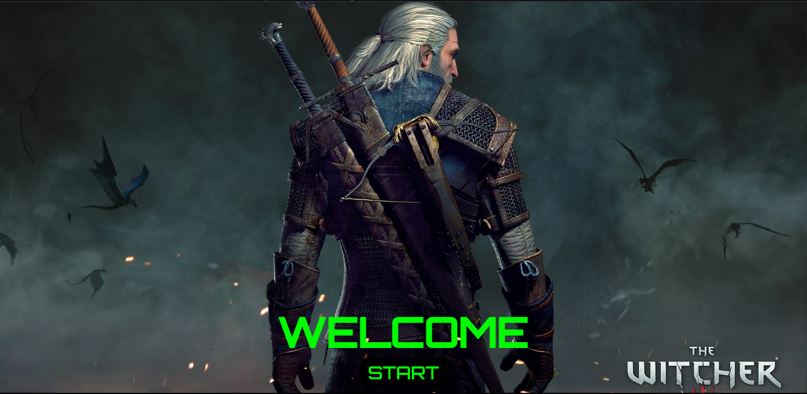
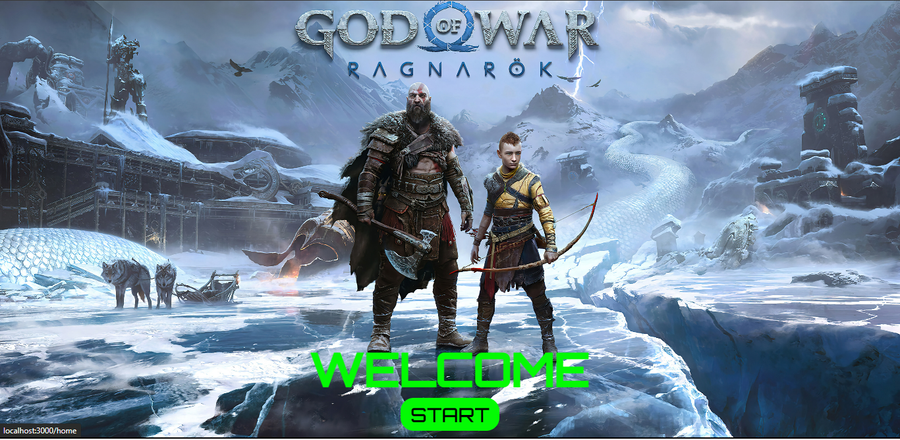
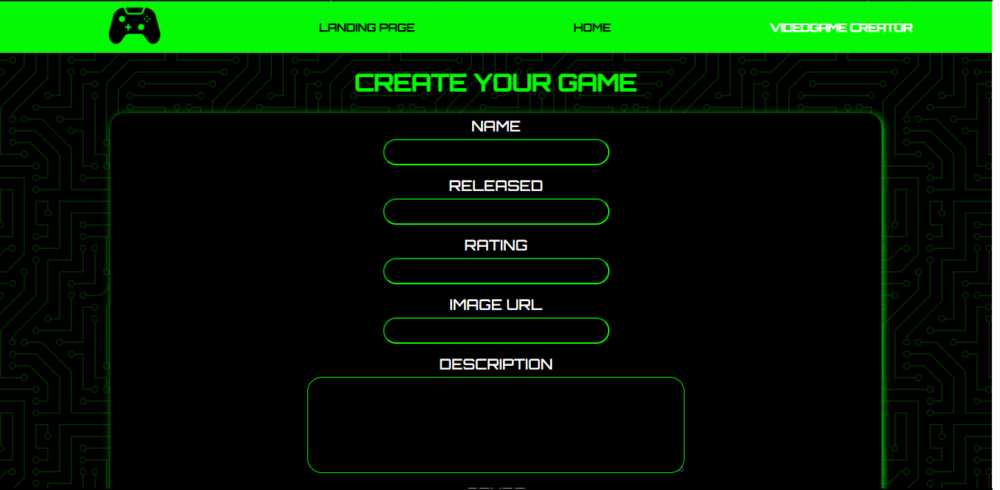
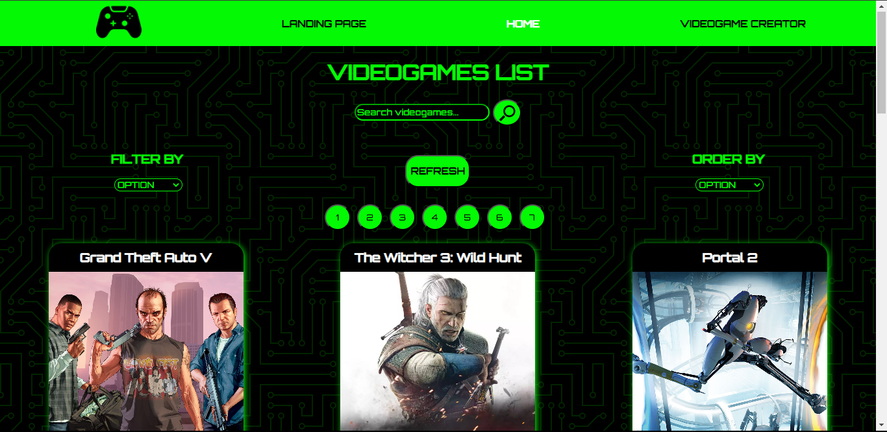
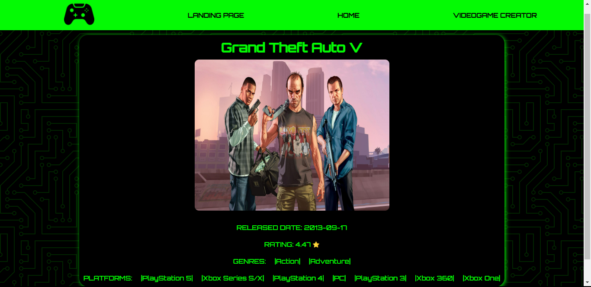
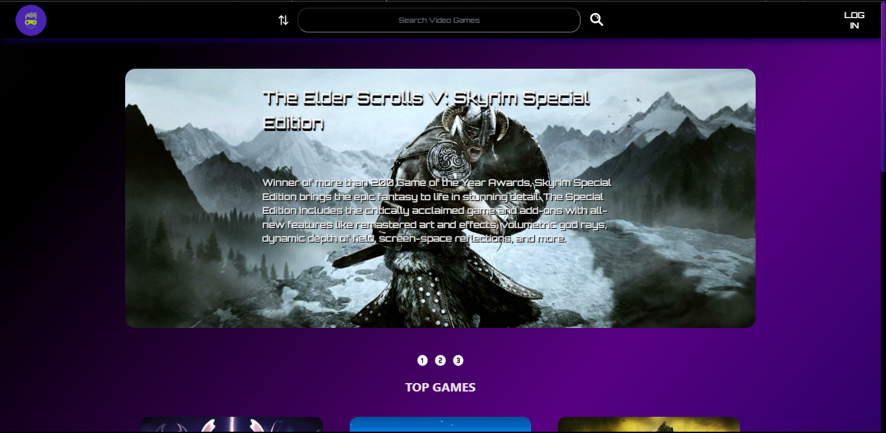
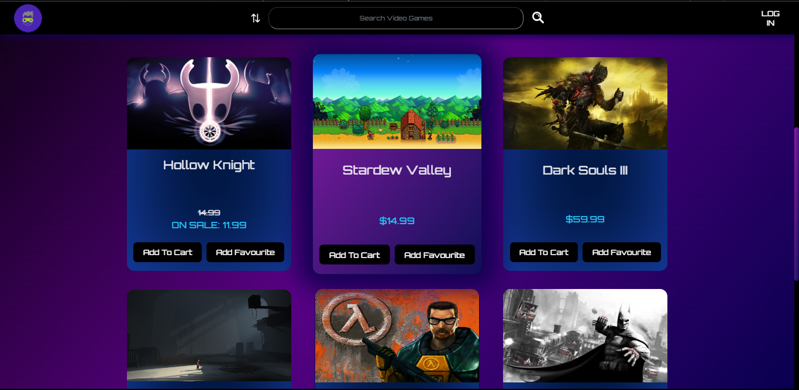
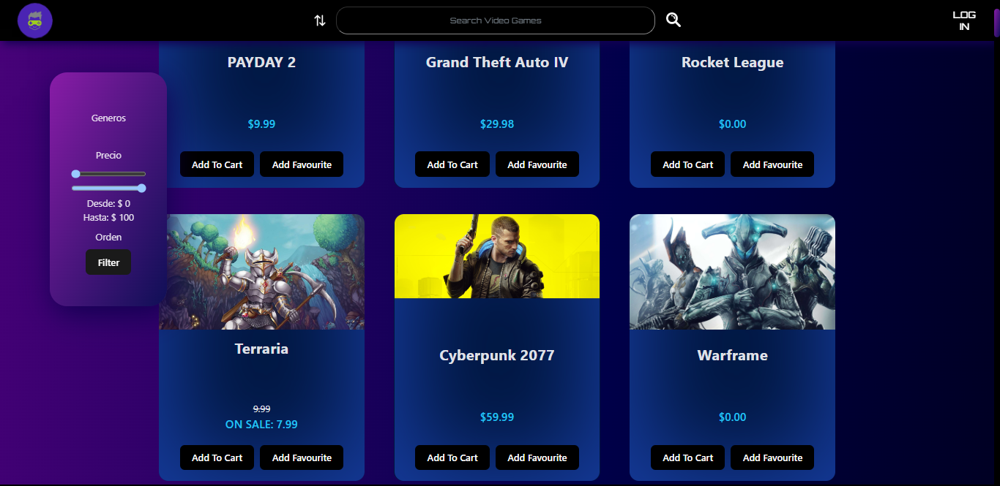
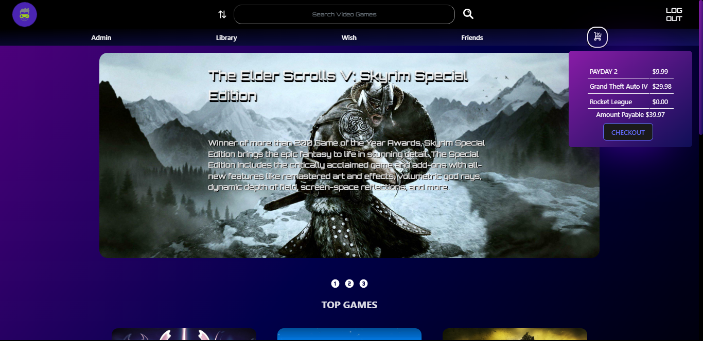

## Juan José Martinez - Full Stack Developer 💻
Hola!!!🙋🏻‍♂️ gracias por venir a visitar mi perfil, soy de la provincia de Mendoza, Argentina y soy Full Stack Developer. Después de hacer un curso de programacion y transitar un bootcamp aprendí todas las herramientas necesarias para poder desarrollarme como profesional en este rubro. Entre mis soft skills destaco el trabajo en equipo, trabajo bajo presión y capacidad para resolver problemas. Mi objetivo es poder ingresar a una empresa donde pueda poner en práctica mis conocimientos y continuar ampliándolos para convertirme en un gran profesional de este apasionante rubro.  
***
## 🔵 Lenguajes de programación  

  
***
## 🟢 Tecnologías/Herramientas  

  
***
## 🟡 Proyectos realizados  

- Proyecto Individual Videogames  

Aplicación de videojuegos, donde se pueden visualizar videojuegos, filtrarlos y crear juegos nuevos a través de un formulario controlado. Las herramientas utilizadas fueron React, Redux, Node, Express y PostgreSQL.  

***
- E-commerce Videogames

Tienda virtual de videojuegos realizada de forma grupal utilizado SCRUM y metodologías ágiles, donde se pueden visualizar videojuegos, filtrarlos, loguearse como usuario, hacer compras a través de Mercado Pago, enviar solicitudes de amistad, hacer comentarios sobre los productos y darles una valoración. Las herramientas utilizadas fueron React, Redux-Toolkit, Node, Express, PostrgreSQL, Auth0, TypeScript, Vite, entre otras.  

Deploy:  https://games-store-v.netlify.app/

## 🟠 Como contactarme  

- 📲 2616180757

- 📧 juanjomm71@gmail.com

- 🌐 www.linkedin.com/in/juan-jose-martinez-manno
 
